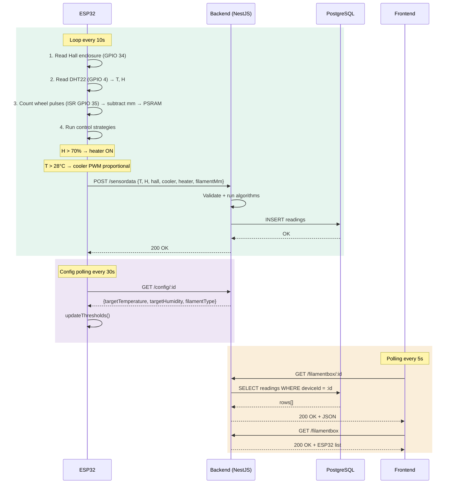

# Sequence Diagram — FilamentBox IoT System

```mermaid
sequenceDiagram
    participant ESP32
    participant Backend as Backend (NestJS)
    participant DB as PostgreSQL
    participant Frontend

    rect rgb(230, 245, 238)
        Note over ESP32: Loop every 10s
        ESP32->>ESP32: 1. Read Hall enclosure (GPIO 34)
        ESP32->>ESP32: 2. Read DHT22 (GPIO 4) → T, H
        ESP32->>ESP32: 3. Count wheel pulses (ISR GPIO 35) → subtract mm → PSRAM
        ESP32->>ESP32: 4. Run control strategies
        Note over ESP32: H > 70% → heater ON
        Note over ESP32: T > 28°C → cooler PWM proportional
        ESP32->>Backend: POST /sensordata {T, H, hall, cooler, heater, filamentMm}
        Backend->>Backend: Validate + run algorithms
        Backend->>DB: INSERT readings
        DB-->>Backend: OK
        Backend-->>ESP32: 200 OK
    end

    rect rgb(238, 230, 245)
        Note over ESP32: Config polling every 30s
        ESP32->>Backend: GET /config/:id
        Backend-->>ESP32: {targetTemperature, targetHumidity, filamentType}
        ESP32->>ESP32: updateThresholds()
    end

    rect rgb(250, 238, 218)
        Note over Frontend: Polling every 5s
        Frontend->>Backend: GET /filamentbox/:id
        Backend->>DB: SELECT readings WHERE deviceId = :id
        DB-->>Backend: rows[]
        Backend-->>Frontend: 200 OK + JSON

        Frontend->>Backend: GET /filamentbox
        Backend-->>Frontend: 200 OK + ESP32 list
    end
```
