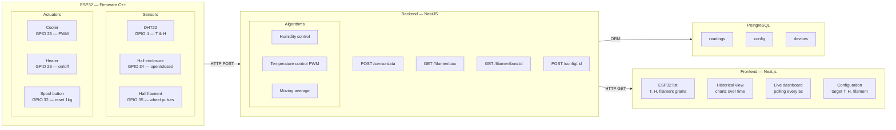

# Component Diagram — FilamentBox IoT System

```mermaid
graph LR
    subgraph ESP32["ESP32 — Firmware C++"]
        subgraph Sensors["Sensors"]
            DHT["DHT22\nGPIO 4 — T & H"]
            HALL1["Hall enclosure\nGPIO 34 — open/closed"]
            HALL2["Hall filament\nGPIO 35 — wheel pulses"]
        end
        subgraph Actuators["Actuators"]
            COOLER["Cooler\nGPIO 25 — PWM"]
            HEATER["Heater\nGPIO 26 — on/off"]
            BUTTON["Spool button\nGPIO 32 — reset 1kg"]
        end
    end

    subgraph Backend["Backend — NestJS"]
        POST_SENSOR["POST /sensordata"]
        GET_BOX["GET /filamentbox"]
        GET_BOX_ID["GET /filamentbox/:id"]
        POST_CONFIG["POST /config/:id"]
        subgraph Algorithms["Algorithms"]
            HUMID["Humidity control"]
            TEMP["Temperature control PWM"]
            AVG["Moving average"]
        end
    end

    subgraph DB["PostgreSQL"]
        READINGS["readings"]
        CONFIG_T["config"]
        DEVICES["devices"]
    end

    subgraph Frontend["Frontend — Next.js"]
        LIST["ESP32 list\nT, H, filament grams"]
        HISTORY["Historical view\ncharts over time"]
        LIVE["Live dashboard\npolling every 5s"]
        CONF["Configuration\ntarget T, H, filament"]
    end

    ESP32 -->|"HTTP POST"| Backend
    Backend -->|"ORM"| DB
    Backend -->|"HTTP GET"| Frontend
```
